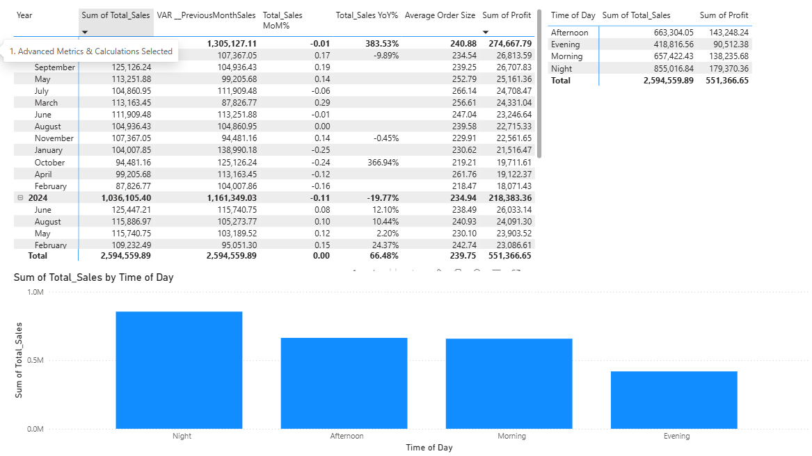

# Dashboards-and-Analysis-

A collection of **Power BI dashboards** and **data analysis reports** showcasing sales performance and Amazon product analytics.

## Projects

### 1) Sales Performance Dashboard (Power BI)
**File:** `dash_sales.pbix`

**What you can analyze**
- Total Sales (overall)
- Quantity Sold
- Profit
- Average Order Size
- Month-over-Month (MoM%) & Year-over-Year (YoY%) change
- Performance breakdown by Region, Product Category, Sales Rep, and Time of Day

**Key visuals (from the report)**
- KPI cards: Total Sales, Quantity Sold, Profit, Avg Order Size, MoM%
- Time series: Average Total Sales by Month, Profit by Month
- Breakdown charts: Sales & Quantity by Sales Rep, Sales by Product Category
- Region comparison: Total Sales vs Return Flag

**Preview (Sales)**
> These previews are screenshots of the PBIX report pages.

---

### 2) Amazon Product Dashboard (Power BI)
**File:** `amazon phones.pbix`

**What you can analyze**
- Total sales volume
- Average product price
- Average rating
- Top sold products (Top 5)
- Prime vs Non-Prime product distribution
- Price comparison (Original vs Minimum Offer)
- Amazon Choice & Best Seller counts

**Preview (Amazon)**

---

## How to run
1. Install **Microsoft Power BI Desktop**.
2. Clone/download the repo.
3. Open any `.pbix` file:
   - `dash_sales.pbix`
   - `amazon phones.pbix`
   - `DashBoard.pbix`

## Author
**Mostafa Ayman**  
GitHub: https://github.com/MostafaAyman3